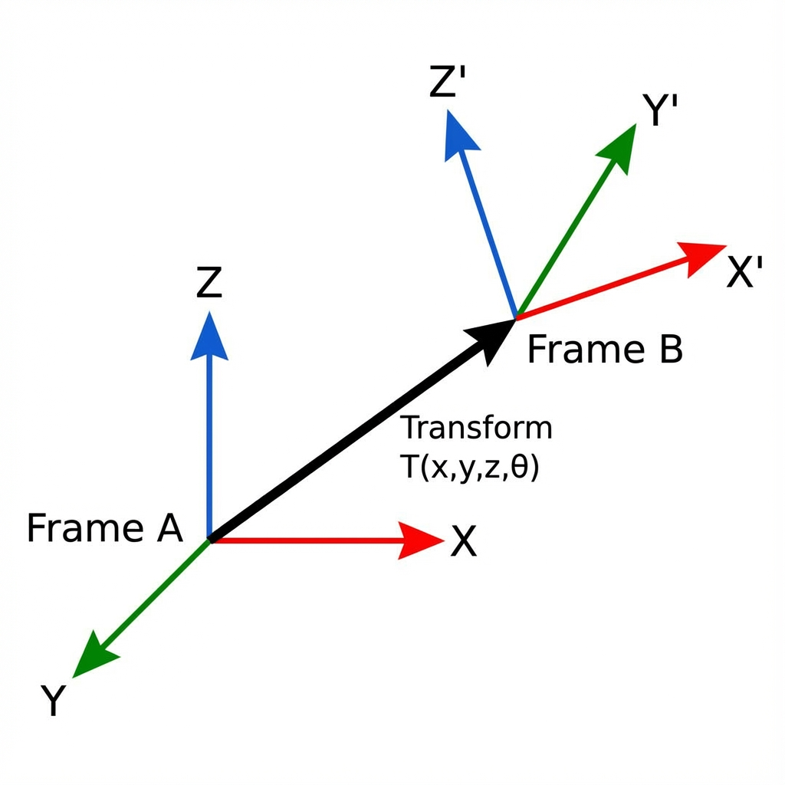
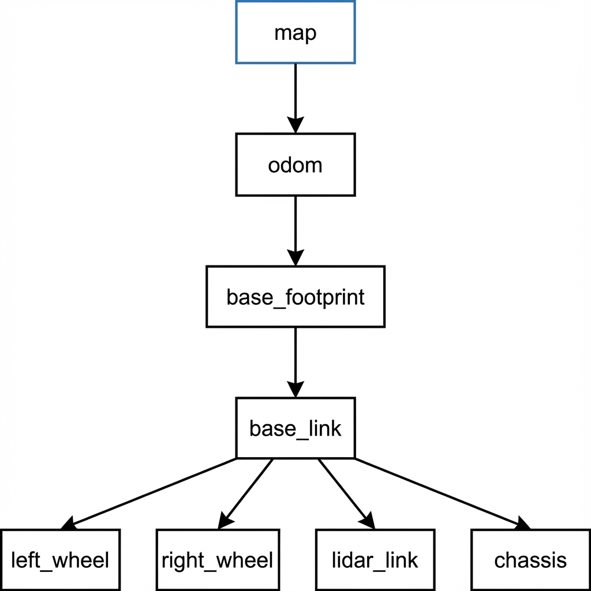
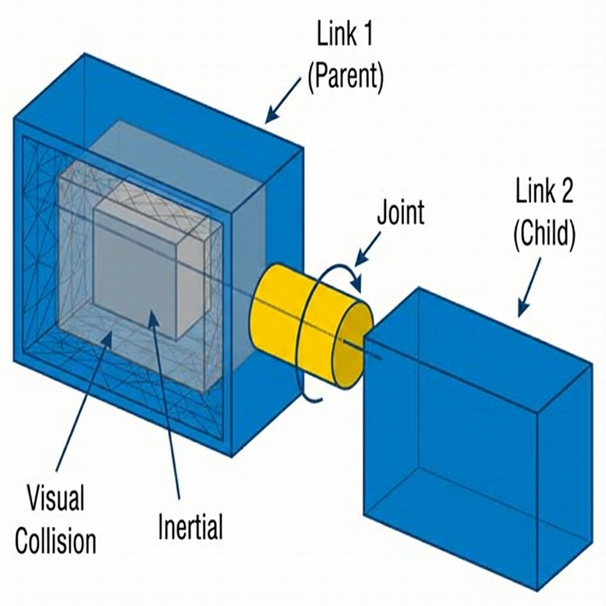
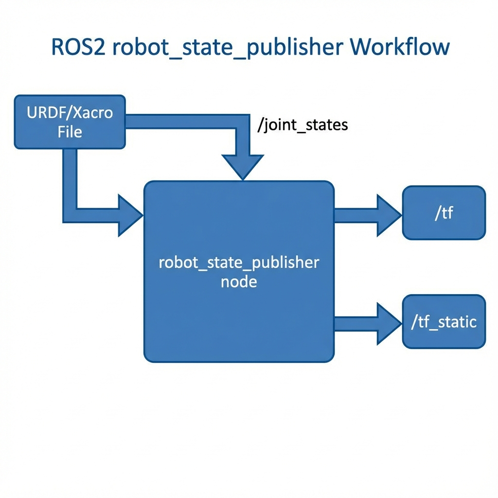
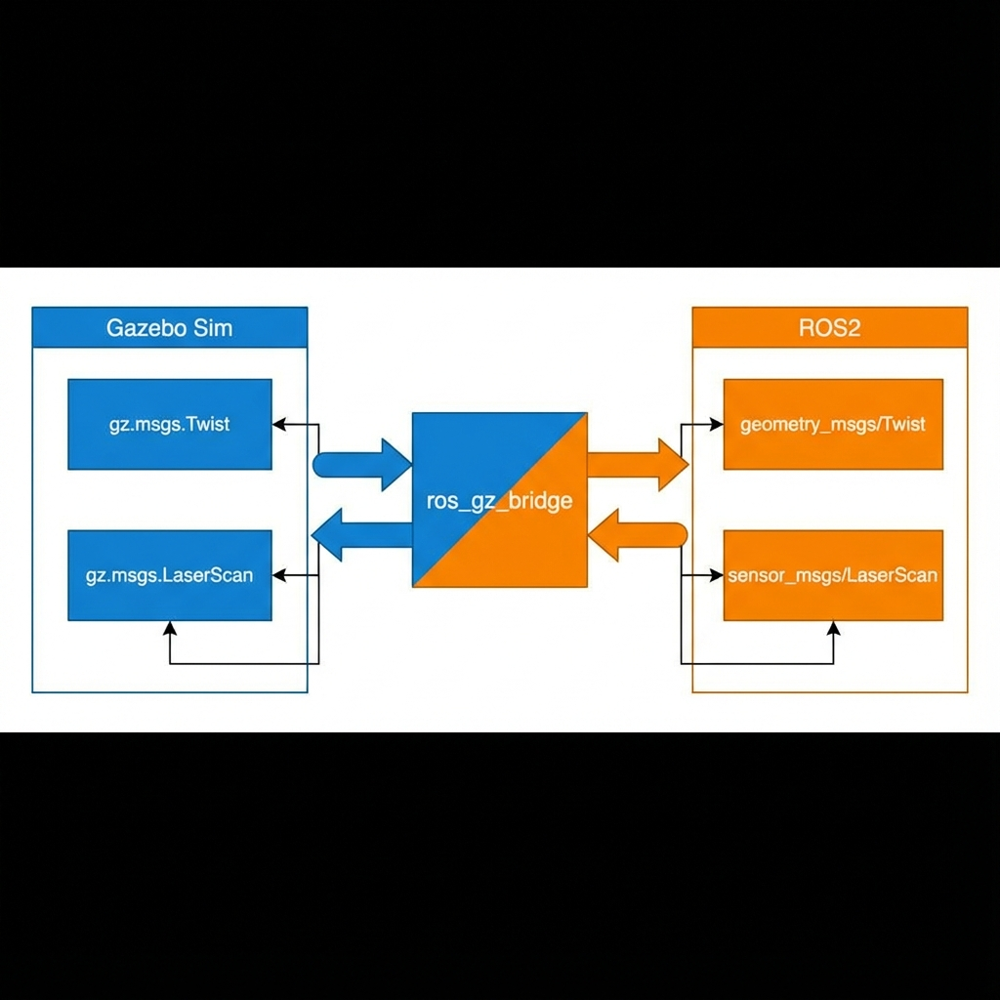
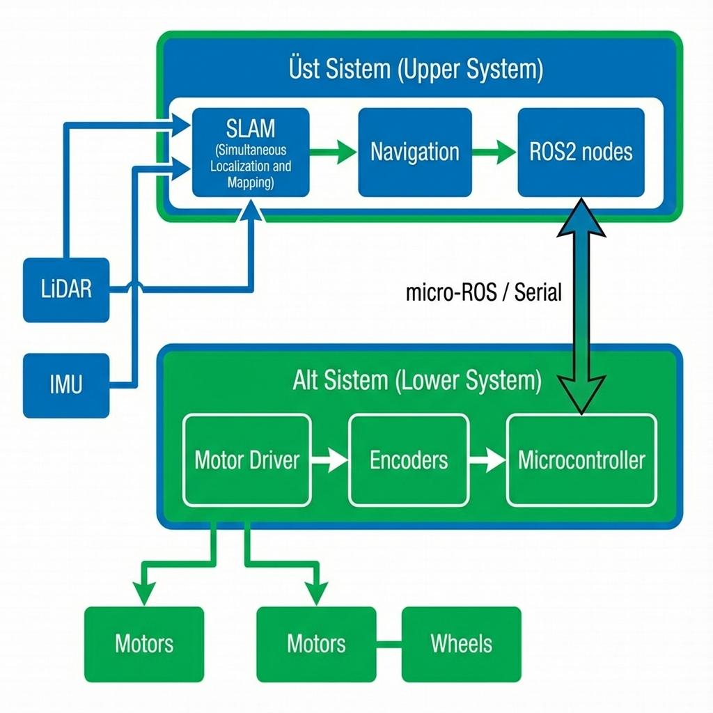
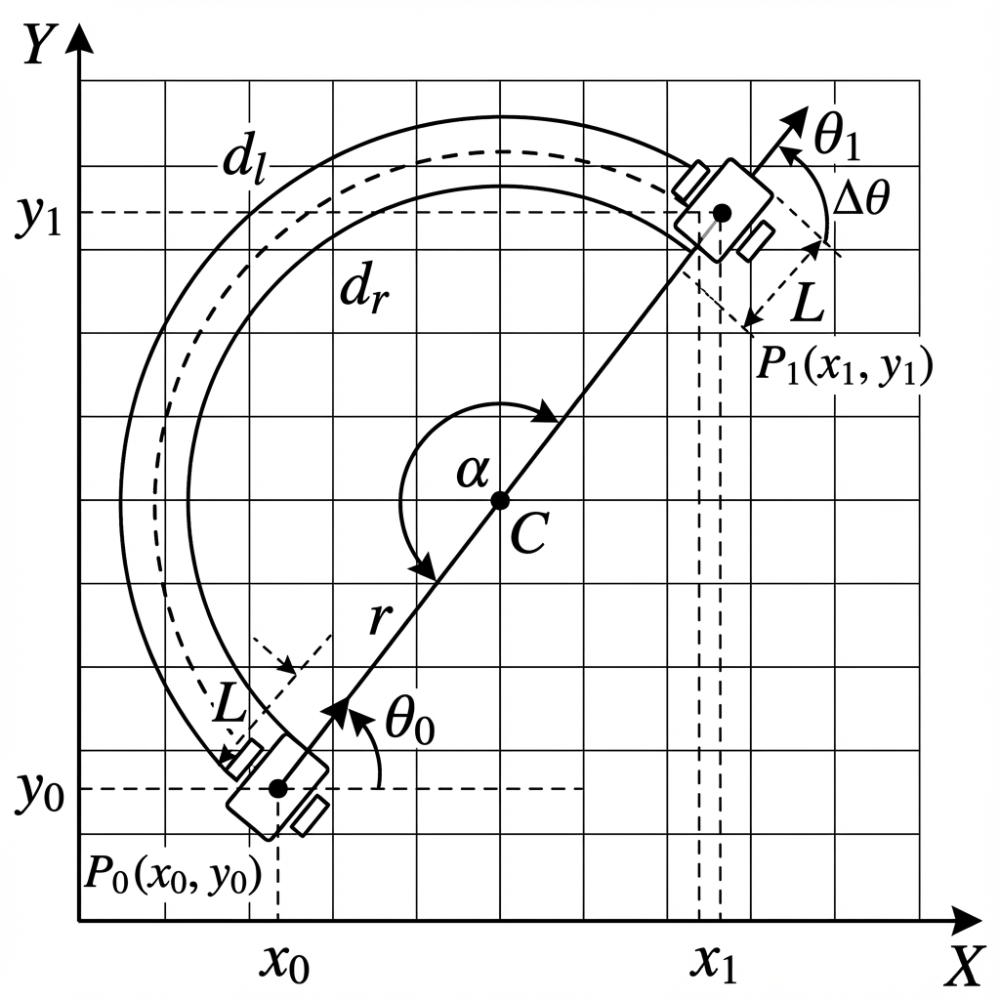

# ROS2 ile AMR Geliştirme El Kitabı

---

## Fihrist

1. **[Önsöz – Amaç](#önsöz--amaç)**

2. **[Konumlama](#konumlama)**  
   2.1 [Temel Kavramlar](#temel-kavramlar)  
   2.2 [Transform (Frame'ler Arasındaki İlişki)](#transform-frameler-arasındaki-i̇lişki)  
   2.3 [Frame Ağacı (TF Tree)](#frame-ağacı-tf-tree)

3. **[Modelleme (URDF)](#modelleme-urdf)**  
   3.1 [Temel Kavramlar](#temel-kavramlar-link-ve-joint)  
   3.2 [Link Anlatısı](#link-anlatısı)  
   3.3 [Joint Anlatısı](#joint-anlatısı)  
   3.4 [URDF Anlatısı](#urdf-anlatısı)  
   3.5 [Modelin ROS2'ye Aktarımı](#urdf---ros2-bağlantısı)  
   3.6 [Model Örneği](#modelleme-örneği)  
   3.7 [Xacro Aracı](#xacro-aracı)

4. **[Simülasyon (Gazebo)](#simülasyon-gazebo)**  
   4.1 [SDF (Simulation Definition Format)](#sdf-simulation-description-format)  
   4.2 [SDF - URDF Etkileşimi](#sdf---urdf-etkileşimi)  
   4.3 [Gazebo - ROS Bağlantısı](#gazebo---ros-bağlantısı)  
   4.4 [Pluginler](#plugin-anlatısı)  
   4.5 [Sensörler](#sensörler)  
   4.6 [Dünya Oluşturma](#gazebo-dünyaları)  
   4.7 [Model Oluşturma](#gazebo-modelleri)

5. **[Haritalama (slam_toolbox)](#haritalama-slam_toolbox)**  
   5.1 [slam_toolbox Nedir?](#slam_toolbox-nedir)  
   5.2 [Çalışma Prensibi](#slam_toolbox-çalışma-prensibi)  
   5.3 [Modlar ve Özellikler](#slam_toolbox-ne-sunuyor)  
   5.4 [Parametreler](#slam_toolbox-parametreler)  
   5.5 [Genel Kullanım](#slam_toolbox-genel-kullanım)

6. **[Navigasyon (nav2)](#navigasyon-nav2)**  
   6.1 [Nav2 Nedir?](#ros2-nav2-nedir-navigation2)  
   6.2 [Temel Bileşenler](#nav2nin-temel-bileşenleri)  
   6.3 [AMCL Mantığı](#localization-amcl-mantığı-en-önemli-kısım)  
   6.4 [Costmap ve Planlama](#costmap-mantığı-engeller-nasıl-görülür)

7. **[Simülasyon vs Gerçeklik](#simülasyon-vs-gerçeklik)**  
   7.1 [Benzerlik ve Farklılıklar](#benzerlikler-ve-farklılıklar)  
   7.2 [Temel Sistem Tasarımı](#temel-sistem-tasarımı)  
   7.3 [Üst Sistem](#üst-sistem-nasıl-gerçekleştirilir)  
   7.4 [Alt Sistem](#alt-sistem-nasıl-gerçekleştirilir)  
   7.5 [Dikkat Edilmesi Gerekenler](#dikkat-edilmesi-gerekenler)

---

# Önsöz – Amaç

Bu el kitabı, **ROS2** altyapısı kullanılarak **Otonom Mobil Robot (AMR)** geliştirme sürecini profesyonel ve sistematik bir şekilde öğrenmek isteyen mühendisler, öğrenciler ve araştırmacılar için hazırlanmıştır.

### Bu Dokümanın Hedefleri

- AMR geliştirirken ihtiyaç duyulan **temel teorik kavramları** aktarmak
- ROS2 ekosisteminin AMR'lerle ilişkili bileşenlerini ayrıntılı biçimde tanıtmak
- Uygulamaya yönelik, düzenli ve **tek kaynaktan takip edilebilir** bir referans sunmak
- Simülasyonda bir AMR'yi tasarlamak ve test etmek
- Gerçek robot üzerinde kullanılabilecek sağlam bir bilgi temeli oluşturmak

> **📌 Not:** Bu dokümana eşlik eden uygulama alıştırmaları için **GARPamr_edu** projesine bakınız.

---

# Konumlama

**Konumlama** (*localization*), bir robotun uzayda hangi pozisyonda ve hangi yönelimde bulunduğunun ölçülmesi ve hesaplanması sürecidir. AMR sistemleri için konumlama, robotun çevresini anlaması ve güvenli şekilde hareket edebilmesi adına kritik bir bileşendir.

> **⚠️ Konumlama doğru yapılmadığında:**
> - Robot harita oluşturamaz
> - Var olan harita üzerinde kendi konumunu bilemez
> - Navigasyon ve çarpışma önleme mekanizmaları düzgün çalışamaz

ROS2, bu ihtiyacı karşılamak için **`tf2`** ismindeki güçlü koordinat sistemi yönetim altyapısını sağlar.

---

## Temel Kavramlar

Konumlama sisteminin temelinde iki önemli kavram bulunur: **frame** ve **transform**.

### Frame (Çerçeve)

Bir **frame**, uzayda bir referans noktasıdır. Her sensör, her robot parçası ve robotun kendisi bir frame ile temsil edilir.

### Transform (Dönüşüm)

**Transform**, iki frame arasındaki göreli konum ve yönelim farkını ifade eder:

> *"A frame'ine göre baktığımızda B frame'i nerededir?"*

---

## Transform (Frame'ler Arasındaki İlişki)

Bir transform konumlama olarak şu iki bilgiyi içerir:

| Bileşen | Açıklama |
|---------|----------|
| **Pozisyon** | `x, y, z` koordinatları |
| **Oryantasyon** | `x, y, z, w` (quaternion) |

<div align="center">
  
  <p><em>Şekil 1: Frame A'dan Frame B'ye transform gösterimi</em></p>
</div>

Matematiksel olarak:

$$
B = A + T
$$

Burada **$T$**, $A \rightarrow B$ dönüşümünü ifade eder. Yani B'nin konumu, A frame'i baz alınarak hesaplanır.

### Transform'ların Kullanım Alanları

- Bir **LiDAR** sensöründen gelen nokta bulutu robot gövdesine göre konumlandırılır
- Tekerleklerin konumu gövdeye göre belirlenir
- Haritadaki konum robotun kendi local frame'iyle ilişkilendirilir

---

## Frame Ağacı (TF Tree)

ROS2'de tüm frame'ler **hiyerarşik bir ağaç yapısı** oluşturur. Bu yapıya **TF Tree** denir.

<div align="center">
  
  <p><em>Şekil 2: Diferansiyel sürüşlü mobil robot için tipik TF ağacı</em></p>
</div>

### TF Tree Kuralları

- Bir frame'in **yalnızca bir ebeveyni** olabilir
- Bir frame'in **birden fazla çocuğu** olabilir
- Herhangi iki frame arasındaki konum, zincir takip edilerek hesaplanabilir

### Örnek Transform Hesaplaması

$$
T_{\text{robot→A}} = T_{\text{map→A}} - T_{\text{map→robot}}
$$

Bu yöntem, gerçek zamanlı ve tutarlı konumlama için temel altyapıyı sağlar.

---

# Modelleme (URDF)

Robotu simülasyon ortamında veya gerçek dünyada çalıştırabilmek için önce robotun fiziksel yapısının tanımlanması gerekir. ROS2'de robot modelleme için **URDF (Unified Robot Description Format)** kullanılır.

### URDF ile Tanımlanabilenler

- Geometri (şekil, boyut)
- Eklemler (joint'ler)
- Kütle ve atalet özellikleri
- Çarpışma modelleri
- Görsel temsil

> **💡 Önemli:** URDF modeli oluşturulduğunda, ROS2 bu modeli otomatik olarak **tf** yapısına dönüştürür:
> - Her **link** → bir **frame**
> - Her **joint** → bir **transform**

---

## Temel Kavramlar (Link ve Joint)

URDF iki ana yapı üzerine kuruludur:

<div align="center">
  
  <p><em>Şekil 3: URDF link ve joint yapısı</em></p>
</div>

### Link

Robotun **fiziksel parçalarını** temsil eder. Gövde, tekerlek, kol segmenti gibi her fiziksel yapı bir link'tir.

### Joint

İki link arasındaki **mekanik bağı ve hareket ilişkisini** tanımlar.

---

## Link Anlatısı

Bir link, üç temel bileşenden oluşur:

### 1. Visual Tag

`<visual>` etiketi, bir link'in simülasyon ortamında **nasıl görüneceğini** tanımlar.

```xml
<visual>
    <origin xyz="0 0 0" rpy="0 0 0" />
    <geometry>
        <box size="1 0.5 0.2" />
    </geometry>
    <material name="gray">
        <color rgba="0.5 0.5 0.5 1" />
    </material>
</visual>
```

### 2. Collision Tag

`<collision>` etiketi, fizik motorunun **çarpışma hesaplamaları** için kullandığı modeli içerir.

```xml
<collision>
    <origin xyz="0 0 0.05" rpy="0 0 0" />
    <geometry>
        <box size="1 0.5 0.2" />
    </geometry>
</collision>
```

> **⚠️ Performans:** Mesh yerine basit geometriler (box, sphere, cylinder) önerilir.

### 3. Inertial Tag

`<inertial>` etiketi, link'in **fiziksel davranışları** için gerekli kütle ve atalet bilgilerini içerir.

```xml
<inertial>
    <origin xyz="0 0 0" rpy="0 0 0" />
    <mass value="1.0" />
    <inertia
        ixx="0.02" ixy="0.0" ixz="0.0"
        iyy="0.02" iyz="0.0"
        izz="0.03" />
</inertial>
```

---

## Joint Anlatısı

URDF dört temel joint türü sunar:

| Joint Türü | Hareket | Limit |
|------------|---------|-------|
| **Fixed** | Sabit | Yok |
| **Revolute** | Sınırlı dönüş | Var |
| **Continuous** | Sınırsız dönüş | Yok |
| **Prismatic** | Doğrusal kayma | Var |

### 1. Fixed Joint

Tamamen **sabit** eklem, hareket etmez:

```xml
<joint name="lidar_mount" type="fixed">
    <parent link="base_link" />
    <child link="lidar_link" />
    <origin xyz="0 0 0.2" rpy="0 0 0" />
</joint>
```

### 2. Revolute Joint

**Sınırlı dönüş** yapabilen eklem:

```xml
<joint name="arm_joint" type="revolute">
    <parent link="arm_base" />
    <child link="arm_link" />
    <origin xyz="0 0 0.1" rpy="0 0 0" />
    <axis xyz="0 0 1" />
    <limit lower="-1.57" upper="1.57" effort="5" velocity="1.0" />
</joint>
```

### 3. Continuous Joint

**Sınırsız dönüş** yapabilen eklem (tekerlekler için):

```xml
<joint name="left_wheel_joint" type="continuous">
    <parent link="base_link" />
    <child link="left_wheel" />
    <origin xyz="0 0.25 0" rpy="0 0 0" />
    <axis xyz="0 1 0" />
</joint>
```

### 4. Prismatic Joint

**Doğrusal hareket** eden eklem:

```xml
<joint name="slider_joint" type="prismatic">
    <parent link="rail" />
    <child link="slider" />
    <axis xyz="1 0 0" />
    <limit lower="0.0" upper="0.3" effort="10" velocity="0.5" />
</joint>
```

---

## URDF Anlatısı

Her URDF dosyası şu yapıyla başlar:

```xml
<?xml version="1.0"?>
<robot name="robot_adi">
    <!-- link ve joint tanımlamaları -->
</robot>
```

---

## URDF → ROS2 Bağlantısı

URDF'in ROS2 tarafında görünür olmasını sağlayan temel mekanizma **`robot_state_publisher`** düğümüdür.

<div align="center">
  
  <p><em>Şekil 4: robot_state_publisher akış şeması</em></p>
</div>

### robot_state_publisher Görevleri

| Görev | Açıklama |
|-------|----------|
| **URDF Okuma** | Kinematik ağaç oluşturur |
| **TF Güncelleme** | `/joint_states` verisiyle transform hesaplar |
| **TF Yayınlama** | Frame ağacını `/tf` ve `/tf_static` topic'lerine yayınlar |

### joint_state_publisher

Test ve görselleştirme için `/joint_states` verisi yayınlayan yardımcı düğüm:

```bash
ros2 run joint_state_publisher_gui joint_state_publisher_gui
```

---

## Modelleme Örneği

Basit bir URDF örneği:

```xml
<?xml version="1.0"?>
<robot name="deneme">
    <!-- Ana gövde -->
    <link name="link1">
        <visual>
            <geometry>
                <sphere radius="0.1"/>
            </geometry>
            <material name="my_blue">
                <color rgba="0 0 1 1" />
            </material>
        </visual>
    </link>

    <!-- İkinci link -->
    <link name="link2">
        <visual>
            <geometry>
                <box size="0.4 0.2 0.1"/>
            </geometry>
            <material name="my_green">
                <color rgba="0 1 0 1" />
            </material>
        </visual>
    </link>

    <!-- Dönel eklem -->
    <joint name="joint_link1_to_link2" type="revolute">
        <parent link="link1"/>
        <child link="link2"/>
        <origin xyz="0 0 0.15" rpy="0 0 0"/>
        <axis xyz="0 0 1"/>
        <limit lower="-1.57" upper="1.57" effort="5" velocity="1.0"/>
    </joint>
</robot>
```

### Çalıştırma

```bash
ros2 run robot_state_publisher robot_state_publisher --ros-args -p robot_description:="$(cat deneme.urdf)"
rviz2
```

---

## Xacro Aracı

**Xacro (XML Macros)**, URDF'i makrolar ve değişkenler aracılığıyla modülerleştiren bir ön işlemcidir.

### Xacro Özellikleri

| Özellik | Açıklama |
|---------|----------|
| **Makro** | `<xacro:macro>` ile tekrarlayan bloklar |
| **Parametre** | `<xacro:property>` ile değişkenler |
| **Koşullu** | `<xacro:if>` ile koşullu içerik |
| **Dahil Etme** | `<xacro:include>` ile dosya parçalama |

### Makro Örneği

```xml
<xacro:macro name="wheel" params="name x y radius">
    <link name="${name}">
        <visual>
            <geometry>
                <cylinder radius="${radius}" length="0.04"/>
            </geometry>
        </visual>
    </link>
    <joint name="${name}_joint" type="continuous">
        <parent link="base_link"/>
        <child link="${name}"/>
        <origin xyz="${x} ${y} 0"/>
        <axis xyz="0 1 0"/>
    </joint>
</xacro:macro>

<!-- Kullanım -->
<xacro:wheel name="left_wheel" x="0" y="0.2" radius="0.1"/>
<xacro:wheel name="right_wheel" x="0" y="-0.2" radius="0.1"/>
```

---

# Simülasyon (Gazebo)

**Gazebo**, robotik için geliştirilmiş güçlü bir simülasyon platformudur:

- Gerçekçi fizik motorları
- Kolay modellenebilir dünya yapısı
- ROS2 ile doğal entegrasyon
- Sensör simülasyonu (kamera, LiDAR, IMU...)
- Plugin sistemi

### Gazebo Classic vs Gazebo Sim

| Özellik | Gazebo Classic | Gazebo Sim (Ignition) |
|---------|----------------|----------------------|
| Durum | Eski nesil | Yeni nesil ✅ |
| ROS2 Uyumu | Kısıtlı | Tam entegrasyon |
| Gelişim | Durduruldu | Aktif |

> **Bu eğitimde Gazebo Sim kullanılmaktadır.**

### Kurulum

```bash
sudo apt update
sudo apt install gz-sim ros-${ROS_DISTRO}-ros-gz
```

---

## SDF (Simulation Description Format)

**SDF**, URDF'e kıyasla daha kapsamlı bir model tanımlama formatıdır:

| Özellik | URDF | SDF |
|---------|------|-----|
| Sensör tanımı | Sınırlı | Tam destek |
| Dünya tanımı | Yok | Var |
| Fizik parametreleri | Temel | Detaylı |
| Simülasyon odaklı | Hayır | Evet |

```xml
<sdf version="1.6">
  <model name="simple_box">
    <static>false</static>
    <link name="link">
      <visual name="visual">
        <geometry>
          <box><size>1 1 1</size></box>
        </geometry>
      </visual>
    </link>
  </model>
</sdf>
```

---

## SDF - URDF Etkileşimi

URDF içinde `<gazebo>` etiketleri kullanarak SDF özelliklerine erişebilirsiniz:

### Plugin Ekleme

```xml
<gazebo>
  <plugin
    filename="gz-sim-diff-drive-system"
    name="gz::sim::systems::DiffDrive">
    <topic>cmd_vel</topic>
    <left_joint>left_wheel_joint</left_joint>
    <right_joint>right_wheel_joint</right_joint>
  </plugin>
</gazebo>
```

### Fizik Parametreleri

```xml
<gazebo reference="caster_wheel">
  <collision>
    <surface>
      <friction>
        <ode>
          <mu>0.001</mu>
          <mu2>0.001</mu2>
        </ode>
      </friction>
    </surface>
  </collision>
</gazebo>
```

---

## Gazebo - ROS Bağlantısı

Gazebo Sim, **Gazebo Transport** adında ROS2 ile doğrudan uyumlu olmayan bir iletişim altyapısı kullanır.

<div align="center">
  
  <p><em>Şekil 5: Gazebo ↔ ROS2 köprü mimarisi</em></p>
</div>

### ros_gz_sim Paketi

```python
# Gazebo'yu başlat
IncludeLaunchDescription(
    PythonLaunchDescriptionSource(
        os.path.join(get_package_share_directory('ros_gz_sim'),
                     'launch', 'gz_sim.launch.py')
    ),
    launch_arguments={'gz_args': '-r empty.sdf'}.items()
)

# Robot spawn et
Node(
    package='ros_gz_sim',
    executable='create',
    parameters=[{'topic': 'robot_description'}],
)
```

### ros_gz_bridge Yapılandırması

```yaml
# gz_bridge.yaml
- ros_topic_name: "cmd_vel"
  gz_topic_name: "robot/cmd_vel"
  ros_type_name: "geometry_msgs/msg/Twist"
  gz_type_name: "gz.msgs.Twist"
  direction: ROS_TO_GZ

- ros_topic_name: "lidar/scan"
  gz_topic_name: "lidar/scan"
  ros_type_name: "sensor_msgs/msg/LaserScan"
  gz_type_name: "gz.msgs.LaserScan"
  direction: GZ_TO_ROS
```

---

## Plugin Anlatısı

**Plugin**, simülasyon ortamındaki bir modelin davranışını tanımlayan C++ modülüdür.

### AMR İçin Gerekli Pluginler

| Plugin | Görev |
|--------|-------|
| **Joint State Publisher** | Eklem durumlarını yayınlar |
| **Odometry Publisher** | Konum ve hız tahmini |
| **Differential Drive** | Hareket kontrolü |

### Joint State Publisher

```xml
<plugin 
    filename="gz-sim-joint-state-publisher-system"
    name="gz::sim::systems::JointStatePublisher">
    <topic>robot/joint_states</topic>
</plugin>
```

### Odometry Publisher

```xml
<plugin
    filename="gz-sim-odometry-publisher-system"
    name="gz::sim::systems::OdometryPublisher">
    <odom_topic>robot/odom</odom_topic>
    <odom_frame>odom</odom_frame>
    <robot_base_frame>base_footprint</robot_base_frame>
</plugin>
```

### Differential Drive

```xml
<plugin
    filename="gz-sim-diff-drive-system"
    name="gz::sim::systems::DiffDrive">
    <topic>robot/cmd_vel</topic>
    <left_joint>left_wheel_joint</left_joint>
    <right_joint>right_wheel_joint</right_joint>
    <wheel_separation>0.4</wheel_separation>
    <wheel_radius>0.1</wheel_radius>
</plugin>
```

---

## Sensörler

Sensörlerin çalışması için **iki bileşen** gerekir:

1. **SDF `<sensor>` Tanımı** - Teknik özellikler
2. **Sensör System Plugin'i** - İşleyici altyapı

### LiDAR Sensörü

```xml
<sensor name="gpu_lidar" type="gpu_lidar">
    <topic>lidar/scan</topic>
    <update_rate>10</update_rate>
    <ray>
        <scan>
            <horizontal>
                <samples>640</samples>
                <min_angle>-3.14</min_angle>
                <max_angle>3.14</max_angle>
            </horizontal>
        </scan>
        <range>
            <min>0.08</min>
            <max>15.0</max>
        </range>
    </ray>
    <always_on>true</always_on>
    <visualize>true</visualize>
</sensor>
```

### IMU Sensörü

IMU için **ek plugin** gerekir:

```xml
<!-- World'e ekle -->
<plugin filename="gz-sim-imu-system"
        name="gz::sim::systems::Imu"/>

<!-- Modele ekle -->
<sensor name="imu_sensor" type="imu">
    <always_on>true</always_on>
    <update_rate>100</update_rate>
    <topic>imu/data</topic>
</sensor>
```

---

## Gazebo Dünyaları

Dünya dosyası SDF formatındadır:

```xml
<?xml version="1.0" ?>
<sdf version="1.6">
  <world name="my_world">
    <!-- Fizik -->
    <physics name="default" type="ode">
      <max_step_size>0.001</max_step_size>
    </physics>

    <!-- Yerçekimi -->
    <gravity>0 0 -9.81</gravity>

    <!-- Işık -->
    <light name="sun" type="directional">
      <pose>0 0 10 0 0 0</pose>
      <diffuse>1 1 1 1</diffuse>
    </light>

    <!-- Zemin -->
    <include>
      <uri>model://ground_plane</uri>
    </include>

    <!-- Sensör sistemi -->
    <plugin filename="gz-sim-sensors-system"
            name="gz::sim::systems::Sensors">
      <render_engine>ogre2</render_engine>
    </plugin>
  </world>
</sdf>
```

---

## Gazebo Modelleri

### Model Klasör Yapısı

```
my_model/
├── model.config
├── model.sdf
└── meshes/
    └── model.stl
```

### model.config

```xml
<?xml version="1.0" ?>
<model>
    <name>my_model</name>
    <version>1.0</version>
    <sdf version="1.6">model.sdf</sdf>
</model>
```

### Model Kullanım Yöntemleri

| Yöntem | Taşınabilir | Offline | Önerilir |
|--------|-------------|---------|----------|
| Tam dosya yolu | ❌ | ✅ | ❌ |
| Gazebo Fuel | ✅ | ❌ | Kısmen |
| Resource path | ✅ | ✅ | ✅ |

---

# Haritalama (slam_toolbox)

**Haritalama**, bir robotun çevresini sensör verileri ve konum tahmini kullanarak sayısal bir temsil haline getirmesidir.

---

## slam_toolbox Nedir?

`slam_toolbox`, ROS2 ekosistemi için geliştirilmiş **2D SLAM** pakettir:

- **Localization**: Robotun konumunu tahmin etme
- **Mapping**: Çevrenin haritasını oluşturma

### SLAM Problemi

| Soru | Cevap |
|------|-------|
| Robot nerede? | Localization |
| Çevre nasıl? | Mapping |

> Bu iki soru birbirini etkiler - SLAM her ikisini aynı anda çözer.

---

## slam_toolbox Çalışma Prensibi

### Kullanılan Veriler

- **2D LiDAR**: `sensor_msgs/LaserScan`
- **TF Dönüşümleri**: `map → odom → base_link → laser`

### Occupancy Grid Map

- Her hücre bir alanı temsil eder
- Değerler: **0** (boş), **100** (dolu), **-1** (bilinmiyor)

### Temel Kavramlar

| Kavram | Açıklama |
|--------|----------|
| **Pose Graph** | Robotun yolunu düğüm/kenar olarak temsil |
| **Scan Matching** | LiDAR verisini haritayla hizalama |
| **Loop Closure** | Drift'i düzeltmek için döngü tespiti |

---

## slam_toolbox Ne Sunuyor?

### Modlar

| Mod | Amaç |
|-----|------|
| **Mapping** | Yeni harita oluşturma |
| **Localization** | Hazır haritada konumlama |

### Online vs Offline

| Mod | Kullanım |
|-----|----------|
| **Online** | Gerçek zamanlı SLAM |
| **Offline** | Rosbag üzerinden test |

### Sync vs Async

| Mod | Özellik | Öneri |
|-----|---------|-------|
| **Sync** | Yüksek zaman uyumu | Gerçek robot ✅ |
| **Async** | Daha esnek | Yüksek frekanslı sensör |

---

## slam_toolbox Parametreler

### Kritik Parametreler

```yaml
slam_toolbox:
  ros__parameters:
    # Frame'ler
    odom_frame: odom
    map_frame: map
    base_frame: base_footprint
    scan_topic: /scan
    
    # Mod
    mode: mapping  # veya localization
    
    # Harita
    resolution: 0.05
    max_laser_range: 12.0
    
    # Hareket eşikleri
    minimum_travel_distance: 0.3
    minimum_travel_heading: 0.3
    
    # Loop Closure
    do_loop_closing: true
    loop_search_maximum_distance: 3.0
```

---

## slam_toolbox Genel Kullanım

### Haritalama

```bash
# 1. Simülasyonu başlat
ros2 launch my_robot gazebo.launch.py

# 2. SLAM başlat
ros2 launch slam_toolbox online_async_launch.py

# 3. Robotu sür
ros2 run teleop_twist_keyboard teleop_twist_keyboard

# 4. Haritayı kaydet
ros2 run nav2_map_server map_saver_cli -f my_map
```

### Pratik İpuçları

- Robotu **yavaş ve sabit** hızla sürün
- **Ani dönüşlerden** kaçının
- Ortamın mümkün olduğunca **statik** olmasına dikkat edin

---

# Navigasyon (nav2)

---

## ROS2 Nav2 Nedir? (Navigation2)

**Nav2**, ROS2 tabanlı mobil robotların:
- Bir harita üzerinde **konumunu bulması**
- Hedef noktaya **güvenli şekilde gitmesi**
- **Engellerden kaçınması**

için kullanılan modern navigasyon framework'üdür.

### Nav2 Soruları

| Soru | Bileşen |
|------|---------|
| Ben neredeyim? | Localization |
| Nereye gideceğim? | Goal |
| Nasıl gideceğim? | Path Planning |
| Engel varsa? | Obstacle Avoidance |

---

## Nav2'nin Temel Bileşenleri

| Bileşen | Görev |
|---------|-------|
| **Map Server** | Haritayı sağlar |
| **AMCL** | Konumlama |
| **Planner** | Global yol planı |
| **Controller** | Anlık hız komutları |
| **Costmap** | Engel haritaları |
| **Behavior Tree** | Akış yönetimi |

---

## Localization: AMCL Mantığı (En Önemli Kısım)

**AMCL (Adaptive Monte Carlo Localization)**, robotun harita üzerindeki pozisyonunu **olasılıksal** olarak tahmin eder.

### Particle Filter Yaklaşımı

Robot pozisyonu tek nokta değil, **birçok olası pozisyon (particle)** olarak tutulur:

$$
\text{Particle} = (x, y, \theta)
$$

### AMCL Adımları

1. **Başlangıç**: Particle'lar dağıtılır
2. **Hareket**: Odometri ile particle'lar güncellenir
3. **Ölçüm**: LiDAR ile particle'lar ağırlıklandırılır
4. **Resampling**: İyi particle'lar çoğaltılır

---

## Costmap Mantığı (Engeller Nasıl Görülür?)

### İki Costmap Türü

| Costmap | Kapsam | Kullanım |
|---------|--------|----------|
| **Global** | Tüm harita | Uzun vadeli planlama |
| **Local** | Robot çevresi | Anlık engel kaçınma |

### Inflation Layer

Engellere yaklaşmak "pahalı" hale getirilir → Robot duvara sürtmez.

---

## Path Planning (Planner)

### Yaygın Planner'lar

| Planner | Özellik |
|---------|---------|
| **NavFn / A*** | Grid tabanlı |
| **Smac Planner** | Daha düzgün yollar |

### Çıktı

```
Global Path → waypoint listesi
```

---

## Controller

Controller, global path'i takip ederek anlık hız komutları üretir:

```
cmd_vel → (linear.x, angular.z)
```

### Yaygın Controller'lar

- **DWB (Dynamic Window Approach)**
- **Regulated Pure Pursuit**

---

# Simülasyon vs Gerçeklik

Simülasyon gerçekliğin taklididir. Gerçek donanım devreye girdiğinde hesaplanması güç hatalar ve beklenmedik durumlar ortaya çıkar.

---

## Benzerlikler ve Farklılıklar

### Değişmeyen (Üst Sistem)

- ROS2 mesaj yapıları
- Robot modeli (URDF)
- SLAM ve Navigation paketleri

### Değişen (Alt Sistem)

| Simülasyon | Gerçek Robot |
|------------|--------------|
| Plugin ile hareket | Motor sürücü kontrolü |
| Otomatik odometri | Encoder hesaplaması |
| Sanal sensörler | Sensör sürücüleri |

---

## Temel Sistem Tasarımı

<div align="center">
  
  <p><em>Şekil 6: AMR Alt Sistem / Üst Sistem mimarisi</em></p>
</div>

### Üst Sistem Görevleri

| Görev | Açıklama |
|-------|----------|
| **SLAM** | Haritalama ve konum tahmini |
| **Navigasyon** | Yol planlama ve takip |
| **Odometri Hesaplama** | Tekerlek verilerinden konum |
| **LiDAR Yayını** | Sensör verisi ROS2'ye aktarım |

### Alt Sistem Görevleri

| Görev | Açıklama |
|-------|----------|
| **Diferansiyel Sürüş** | Hız → motor PWM dönüşümü |
| **Haberleşme** | micro-ROS ile üst sisteme bağlantı |
| **Ölçüm Gönderimi** | Encoder verilerini yayınlama |

---

## Üst Sistem Nasıl Gerçekleştirilir?

### Kritik Parametre Ayarları

#### slam_toolbox

| Parametre | Simülasyon | Gerçek |
|-----------|------------|--------|
| `use_sim_time` | `true` | `false` |
| `scan_topic` | `/scan` | LiDAR'a göre |
| `max_laser_range` | Önemli değil | Gerçek menzil |

#### nav2

| Parametre | Dikkat |
|-----------|--------|
| `footprint` | Gerçek robot boyutları |
| `max_vel_x` | Motor kapasitesi |
| `transform_tolerance` | Artırılmalı |

---

### Odometri Hesaplaması

<div align="center">
  
  <p><em>Şekil 7: Odometri hesabı geometrik gösterim</em></p>
</div>

<div align="center">
  
  <p><em>Şekil 8: Diferansiyel sürüş kinematiği</em></p>
</div>

#### Problem Tanımı

| Değişken | Açıklama |
|----------|----------|
| $d_l$ | Sol teker yolu |
| $d_r$ | Sağ teker yolu |
| $L$ | Tekerler arası mesafe |
| $(x_0, y_0, \theta_0)$ | Başlangıç konumu |
| $(x_1, y_1, \theta_1)$ | Bitiş konumu |

#### Düz Hareket ($d_l \approx d_r$)

$$
x_1 = x_0 + \cos(\theta_0) \cdot \frac{d_l + d_r}{2}
$$

$$
y_1 = y_0 + \sin(\theta_0) \cdot \frac{d_l + d_r}{2}
$$

$$
\theta_1 = \theta_0
$$

#### Eğik (Çembersel) Hareket ($d_l \neq d_r$)

**Yardımcı değişkenler:**

$$
\alpha = \frac{d_r - d_l}{L}
$$

$$
r = \frac{L}{2} \cdot \frac{d_l + d_r}{d_r - d_l}
$$

**Konum güncellemesi:**

$$
x_1 = x_0 + r \cdot (\cos(\theta_0 + \alpha) - \cos(\theta_0))
$$

$$
y_1 = y_0 + r \cdot (\sin(\theta_0 + \alpha) - \sin(\theta_0))
$$

$$
\theta_1 = \theta_0 + \alpha
$$

---

## Alt Sistem Nasıl Gerçekleştirilir?

### Haberleşme (micro-ROS)

**micro-ROS**, mikrodenetleyicilerde ROS2 benzeri programlama sağlar:

```
Mikrodenetleyici (Client) ←→ micro-ROS Agent ←→ ROS2
```

### Diferansiyel Sürüş

#### 1. Teker Hızı Hesaplama

Twist mesajından teker hızlarına:

$$
v_l = v - \frac{\omega \cdot L}{2}
$$

$$
v_r = v + \frac{\omega \cdot L}{2}
$$

Burada:
- $v$: Çizgisel hız (linear.x)
- $\omega$: Açısal hız (angular.z)
- $L$: Tekerler arası mesafe

#### 2. Motor Kontrolü (PID)

**PID** kontrol ile hedef hıza ulaşılır:

$$
u(t) = K_p \cdot e(t) + K_i \cdot \int e(t) \, dt + K_d \cdot \frac{de(t)}{dt}
$$

| Terim | Rol |
|-------|-----|
| **P** | Anlık hata düzeltme |
| **I** | Kalıcı hata giderme |
| **D** | Aşırı tepki önleme |

#### 3. Encoder ile Ölçüm

Encoder darbeleri (pulse) yorumlanarak tekerleğin katettiği yol hesaplanır:

$$
\text{Mesafe} = \frac{\text{Pulse Sayısı}}{\text{PPR}} \times 2\pi r
$$

---

## Dikkat Edilmesi Gerekenler

### Kritik Kontroller

| Parametre | Açıklama |
|-----------|----------|
| `use_sim_time` | Gerçekte **false** olmalı |
| Teker yarıçapı | Hesaplamalarda doğru girilmeli |
| TF frame isimleri | Tutarlı olmalı |
| Zaman damgaları | Senkronize olmalı |

### Odometri İpuçları

> **⚠️ Odometri hesaplaması AMR için en kritik noktadır!**

- Yüksek frekanslı hesaplama → Daha iyi konumlama
- Çift kanallı encoder → İleri/geri yön tespiti
- Hız ortalaması → Kararlı hız değerleri

### Harita Kalitesi

Kötü harita çıkarmanın olası nedenleri:
- ❌ Hatalı odometri
- ❌ Yanlış TF frame isimleri
- ❌ LiDAR frekansı/menzil ayarları
- ❌ Encoder kayması

---

> **📚 Bu doküman, GARPamr_edu projesi için hazırlanmıştır.**